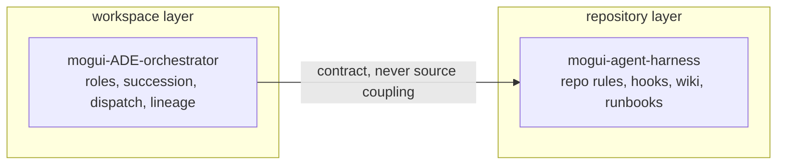

# mogui-ADE-orchestrator

> *Can I run Claude and Codex sessions side by side in tmux, drive any one of them by hand, and still have something orchestrating all of them from above?*

Yes. That is what this is.

Clone this repository, `cd` into it, start any coding agent there, say one sentence. That is the install.

It runs the fleet on [Orca](https://www.onorca.dev/download). A session has to outlive its window and be addressable by handle before anything can orchestrate it. macOS only for now. Python 3.10+, stdlib-only core, MIT. No API key.

## Quickstart

```bash
brew install --cask stablyai/orca/orca
git clone https://github.com/baksohyeon/mogui-ADE-orchestrator
cd mogui-ADE-orchestrator
```

Open that directory in Orca, start any coding agent inside it, and say:

```
Wake the master.
```

Any words work. It walks you through setup and ends by spawning your Generation 1 master. [Getting Started](docs/public/getting-started.md) has the detail.

<details><summary>Prefer to poke at it before installing anything</summary>

The core is stdlib-only, so you can call it without Orca and without setup. You will not get a master session this way, just the pure functions.

```bash
cd mogui-ADE-orchestrator
scripts/master-succeed detect "routine status update" --context-ratio 0.7 --json
scripts/dispatch-gate --ledger /tmp/gate.jsonl check \
  --runtime codex --contract README.md --agents 1 --est-chars 1000
scripts/adapter doctor
```

</details>

## Why this exists

Run one long-lived session as the orchestrator of a multi-repository workspace and three failure modes appear that repo-level tooling does not cover.

1. **Sessions end, work does not.** Context fills, sessions crash, sessions get compacted. Pasting a summary into a fresh session loses role state, open tracks, and standing decisions. You find out when the successor repeats a question you answered, or reopens a decision you made.
2. **A master that can spawn workers can waste them.** Delegation is cheap to trigger and expensive to run. Without a gate, duplicate dispatches, oversized inputs, and dispatches into the wrong tree all go through, and nothing says so.
3. **Context loss after compaction is invisible.** The session reads as continuous while state is gone. Re-feed everything at boot and you lose the one chance to find out what it still holds.

This runtime treats all three as testable. Succession is a guarded procedure. Lineage is an append-only ledger with a fixed schema. Worker dispatch needs a readable contract and passes budget and routing checks. The boot path withholds state after compaction to probe recall.

## How it fits together


Solid arrows are orchestration. Dotted arrows are you. The panes are real terminals, take any of them over.

## Sibling project

Two layers, split by unit of operation. This repository owns the workspace. [mogui-agent-harness](https://github.com/baksohyeon/mogui-agent-harness) owns one repository.



| | mogui-agent-harness | mogui-ADE-orchestrator (this repo) |
|---|---|---|
| Layer | Repository Harness (repo-local runtime) | Workspace Master Runtime |
| Unit of operation | one repository | a workspace of many repositories |
| Owns | repo-local rules, hooks, wiki, runbooks | orchestration state, roles, succession, lineage |

Either runs alone. Use both when a track crosses repositories and each repository still needs its own rules.

## Scope

Local only.

- No network calls. Every import in `src/` and `scripts/` is standard library, none of them networking. `git grep -nE "^[[:space:]]*(import|from)[[:space:]]+(urllib|http|socket|ssl|requests)" -- src scripts` returns nothing.
- No API key, no model endpoint, no telemetry.
- Reads the folder you point it at and paths you name in config. Nothing walks your home directory. Redaction scanners read one repository's tracked files through `git ls-files`.
- The CLIs it drives reach their own providers as before. No traffic added.
- Master starts with approval prompts off, to run unattended. Shift-Tab cycles the mode.

## Limitations

- **Master starts under Claude Code out of the box.** The spawn path in `core/succession.py` calls `claude`. Nothing in the design depends on that, and pointing the line at another CLI is a small change. Claude Code is what has been run, so it is what is recommended.
- **Workers can be any CLI.** A worker is a terminal session in an Orca pane, so it is whatever binary starts there. Claude, Codex, Cursor, Grok, Gemini have all run this way under contract. No plugin for any of them. The typed `adapter dispatch` path is narrower and takes `codex` only.
- **Codex as master should work, and nobody has tried it.** Untested rather than unsupported. If you run it, a report or a patch is welcome.
- **macOS only.** Other platforms planned, untested.
- **Orca required** for live sessions. Pure functions run without it.

## Alternatives

**If you are going to use an API key, use [LangChain deepagents](https://docs.langchain.com/oss/python/deepagents/overview).** It is well documented and it solves this problem inside your process. This project is for the other case: you already pay for coding-agent CLIs and you want one orchestrator driving all of them, with no key and no per-token bill.

| | LangChain deepagents | this |
| --- | --- | --- |
| Cost model | API key, billed per token | your existing CLI subscription |
| Subagent | an actor inside the process | a real CLI session under a contract |
| Filesystem | virtual, pluggable backend | a git worktree |
| Approval | a runtime callback | a gate a human holds |
| Orchestrator dies | the graph dies with it | the successor takes the role and proves it |

The comparison came after. Developer Dorito built this independently and reached this shape before seeing deepagents. `git log -S deepagents --reverse` shows the name first appearing in the same commit as the public docs, fifteen days and sixty commits in. That command dates the word in the repository. It does not date what Dorito knew.

## What this runs on

### Why Orca

A master that outlives one session needs somewhere to live. A terminal tab does not qualify. [Orca](https://www.onorca.dev/download) does, and it is the one dependency this project does not abstract away.

- **Sessions outlive the window.** Close the tab, restart the app, come back tomorrow. The session is there, with a handle you can read, write to, and retire. Succession is auditable because the predecessor stays addressable while you verify the successor.
- **Warm context is money.** A long-lived session keeps its prompt cache warm. Respawning for every task pays the context tax again.
- **Many agents, many accounts.** Run several CLI agents side by side on different runtimes and accounts. Switch when one runs out of credit. A worker's quota does not kill the orchestrator.
- **Placement is addressable.** Every pane carries a worktree identity. "Which folder did that worker run in" has an answer you can check.
- **Reachable from anywhere.** Put it behind Tailscale and the same sessions answer from another machine. Long jobs do not need you at the laptop that started them.

Without this substrate you can read the ideas here. You cannot run a master that survives its own session.

### The tools this actually runs on

Vendor-neutral here means the master is not tied to one *AI agent host*. It does not mean the tooling is a mystery. These are the real dependencies, by name.

| Tool | What it does here | Replaceable? |
| --- | --- | --- |
| [Orca](https://www.onorca.dev/download) | Execution substrate. Terminal sessions that outlive the window, worktree-scoped placement, dispatch and retirement of worker panes. | No. Everything about session lifetime assumes it. |
| [beads](https://github.com/gastownhall/beads) (`bd`) | Work ledger. Tracks, issues, dependencies, and the memory block the boot path audits. `master-bootstrap-live` shells out to `bd` for active-track lines. | Yes, through the adapter. Any tracker with a CLI that lists issues by status works. |
| [ctx](https://ctx.rs) | Session archive index. Lets a master search what an earlier session actually said instead of trusting a summary of it. | Yes, through the adapter. |
| Git | Long-term source of truth. Charters, decisions, runbooks, lineage. Worktrees are also the isolation primitive for workers. | No. |

The split matters: `core/` never learns these names, `adapter/` wires them, and swapping one means writing an adapter rather than editing the units. `adapter/profile.py` currently ships synchronous CLI profiles for `codex` and `cursor-agent`; that is the layer where an agent host gets named, and it is the only one.

### The skill layer it runs under

Nothing to do before you start. Onboarding raises this during setup, explains each one, and asks. Declining all of it is a normal answer. Every script here runs with none of it installed.

Listed here so the recommendation is readable before you are asked. Vendor neutrality covers agent hosts, not tooling.

Optimized for Claude Code. These are Claude Code plugins and skills. Workers can be Codex or another CLI and the adapter ships a `codex` profile. The orchestrator side assumes Claude Code.

| Layer | Tool | What it does in the harness |
| --- | --- | --- |
| Method | [superpowers](https://github.com/obra/superpowers) | Puts process ahead of code. A SessionStart hook injects a rule that a relevant skill must be invoked before any response, including clarifying questions. Ships brainstorming, plan writing and execution, TDD, systematic debugging, code review on both sides, and verification before completion. |
| Lifecycle | [GSD](https://github.com/open-gsd/gsd-core) | The largest harness footprint of the four. A spec to plan to execute to verify command set, plus around a dozen hooks: a statusline, a context monitor that warns the agent rather than only the user as the window fills, prompt-injection scanners over both written and read content, a guard that blocks writes outside the worktree root, and commit validation. |
| Commands | [gstack](https://github.com/garrytan/gstack) | Task commands rather than methodology: ship, review, QA, headless-browser dogfooding, plan review from CEO, engineering, and design angles, context save and restore. |
| State | [beads](https://github.com/gastownhall/beads) | Listed in the table above. The boot path already shells out to it. |

Say yes and onboarding prints the command for you to run. GSD's installer edits `~/.claude/settings.json` and wires hooks across most lifecycle events. An agent should not do that to your configuration.

One integration note if you adopt GSD. Its context monitor warns the agent at 35% context remaining and escalates at 25%, well before the succession threshold this project recommends. Left alone, a master is told to stop and save state while its charter says to keep working. Raise the thresholds in `gsd-context-monitor.js`, or record in your charter that the warning is advisory and not a succession trigger. GSD's `/gsd-update --reapply` flow carries local edits across updates.

## Which document do you want?

| You are | Start here |
| --- | --- |
| Reading about the system for the first time | [`docs/public/overview.md`](./docs/public/overview.md) |
| Installing it on your own workspace | [`master-ops/ONBOARDING.md`](./master-ops/ONBOARDING.md) |
| Looking for a specific document | [`docs/README.md`](./docs/README.md) (the document index) |
| Reading the code | [Architecture](#architecture) below, then `src/master_runtime/core/` |

Documentation in this repository is English. `master-ops/` is a template that gets copied and substituted during onboarding, not documentation about this repository. See the index for why the two are separate.

## Status

Working and exercised: 271 unit tests pass (1 skipped, as of 2026-08-01), every unit listed below exists in `src/master_runtime/core/`, and the succession, dispatch-gate, acceptance, and compaction paths have all run against real workspaces.

Moving fast: interfaces, CLI flags, and file formats still change without notice. Pin a commit if you build on it.

## Core concepts

### Succession

`src/master_runtime/core/succession.py` implements master-to-master handoff as an explicit, guarded procedure rather than a copy-paste. `detect_trigger()` classifies signals into `IMMEDIATE` (explicit user instruction), `ADVISORY` (context usage ratio at or above the `0.60` default, or a natural milestone; advisory triggers **never** auto-start succession, they only propose it), or `NONE`. The flow then builds a handoff, spawns the successor, verifies the successor booted with the inherited state (`PASS` / `PARTIAL` / `FAILED`), checks for duplicate master instances, and retires the predecessor. Hard safety violations raise `SuccessionError` instead of proceeding.

The advisory ratio is a code default, not a claim about what any given workspace should use; an operating charter can set its own threshold.

### Lineage

`src/master_runtime/core/lineage.py` keeps an append-only markdown ledger of every succession: generation number, parent/successor session IDs, inherited role and open tracks, verification result, and honesty metrics such as `repeated_question_count`, `reopened_decision_count`, and a `context_loss_summary`. The schema is fixed (13 required fields), duplicate generations are rejected, and every write is re-verified as append-only. By design, lineage is observability metadata only; it never feeds runtime decisions.

### Contract-gated dispatch

`src/master_runtime/core/dispatch_gate.py` sits between the master and any worker dispatch. A `DispatchRequest` (runtime, contract file path, estimated input characters, agent count) is resolved to a `GateDecision` with a stable reason code: `OK`, `BUDGET_EXCEEDED` (defaults: 500k chars single / 1M batch), `DUPLICATE_CONTRACT` (same contract SHA within a 30-minute window), `ROUTING_VIOLATION`, `CONTRACT_UNREADABLE`, `HIGH_COST_RUNTIME`, `PATH_OUTSIDE_KNOWN_ROOTS`, `WORKTREE_AS_REPO_ROOT`, and others. The gate writes each decision to a JSONL ledger, so you can answer what the master dispatched and why it was allowed.

### Acceptance loop

`src/master_runtime/core/acceptance/` runs candidate changes against a casebook and produces a scorecard instead of trusting a worker's completion report. Raw case results and aggregated scores are separate types, the casebook owns which split a case belongs to (an evaluator cannot relabel its own case), and holdout visibility is a single predicate so the private-holdout invariant cannot drift. Candidates that change nothing still produce a decision record.

### Compaction-resilience probe (E12)

`scripts/master-bootstrap-live` is a session-start hook that emits a small (~1KB budgeted) dynamic bootstrap block and is written to never fail the boot (any internal error degrades to a `[BOOTSTRAP-FALLBACK]` line with exit code 0). When the incoming session event reports `source == "compact"`, the hook **suppresses** the Role State and active-tracks sections. The post-compaction session has to recall that state from its own context first, and you compare what it recalled against the ledger. That turns silent context loss into a number you can read.

## Architecture

```
src/master_runtime/core/
├── bootstrap.py        # session boot: charter + handoff + role state, char-budgeted
├── bootstrap_live.py   # live boot block for session-start hooks (audits, dual-instance check)
├── succession.py       # trigger detection, handoff, spawn/verify/retire
├── lineage.py          # append-only succession ledger
├── dispatch_gate.py    # contract-gated worker dispatch decisions
├── recovery.py         # recovery flow after abnormal termination
├── watchdog.py         # stall detection for dispatched work
├── digest_loop.py      # read-only L1 digest loop for orchestrator observations
├── work_ledger.py      # workspace track ledger and session cache
├── context/            # pure filesystem context resolver (path -> ContextDescriptor)
├── approval/           # approval gates and registry
├── acceptance/         # casebook-driven acceptance loop and scorecards
└── adapter/            # adapter layer: dispatch, doctor, isolation, profile
```

Two principles shape the layout:

- **Core / adapter split.** `core/` modules avoid depending on any specific agent product; contact with the outside world (process spawning, ledgers, tool CLIs) goes through injected callables and the `adapter/` layer, so core logic is testable with in-memory fakes. Tool names live in `adapter/`, not in the units above it.
- **Vendor neutrality as a direction.** The master should run under different AI agent hosts. The spawn path still names `claude`, so Claude Code is the host that has been exercised. The worker side is further along, with `adapter/profile.py` shipping synchronous CLI profiles for `codex` and `cursor-agent`. `adapter doctor` probes a fixed set of local tools, and some Korean-language operator strings are embedded. Broadening this is ongoing work.

## Working on the harness

To use the system, the [Quickstart](#quickstart) above is the whole path. This section is for changing the harness itself.

Prerequisites: macOS and **Python 3.10+**. The runtime is stdlib-only; there is nothing to install.

All CLI entry points live in `scripts/` and are self-contained (they insert `src/` on `sys.path` themselves):

```bash
# Classify a succession trigger signal (pure function, safe to try)
scripts/master-succeed detect "routine status update" --context-ratio 0.7 --json
# → {"status": "ADVISORY", "reason": "context ratio threshold reached", ...}

# Ask the dispatch gate whether a worker dispatch may proceed
scripts/dispatch-gate --ledger ./gate-ledger.jsonl check \
  --runtime codex --contract ./job-contract.md --agents 1 --est-chars 1000
# → {"allow": true, "reason": "OK", "contract_sha": "...", "cost_proxy": 1000}

# Check which adapter-layer tools are present on this machine
scripts/adapter doctor

# Boot a master session from a charter document (add --handoff for a handoff file)
scripts/master-bootstrap --charter path/to/charter.md --json
```

Other entry points, briefly: `scripts/master-succeed` also provides `handoff`, `verify-successor`, `check-duplicates`, `retire`, and `spawn` subcommands; `scripts/master-recover` runs the recovery flow from a charter + handoff after abnormal termination; `scripts/master-bootstrap-live` is meant to be wired as a session-start hook rather than run by hand; `scripts/l1-digest tick` advances the read-only digest loop; `scripts/adapter dispatch` performs an adapter-level worker dispatch; `scripts/acceptance-loop` runs the acceptance casebook. Run any of them with `--help` for current flags.

Tests are the agent's job. Ask the agent working on the harness to run them and report, the same way you ask it for anything else. There is no test step here for a person to type.

## What this is not

This repo owns workspace-level orchestration state only. Repo-local rules, hooks, wikis, and runbooks belong to a repository-harness layer (see the sibling project above); the connection between the two layers is contract-based, never source-tree coupling. Submodules only ever appear as pinned example fixtures, never as core dependencies.

## License

MIT
