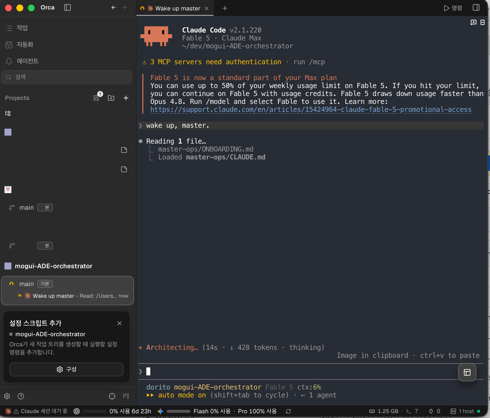
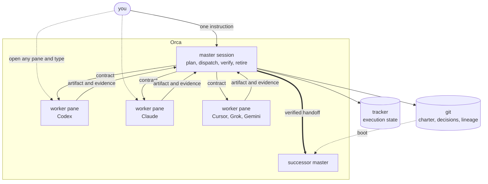
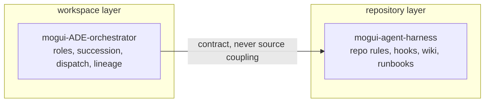

# mogui-ADE-orchestrator

Run one long-lived agent session as the master of a multi-repository workspace. The master plans work, dispatches isolated workers, verifies their reports, records lineage, and hands the role to a successor when the current session reaches its limits.

This is for people who already use coding-agent CLIs and want one supervised workspace layer above them. Any mix of worker CLIs can run in Orca terminals. Claude Code as the master is the path that has been exercised hardest.

Existing installations: compare the `Template version` line in your operations repository's `docs/MASTER-OPERATIONS.md` with `master-ops/TEMPLATE-VERSION` in the current template, then read the matching entries in `master-ops/CHANGELOG.md`. Local edits win. Watching releases on this repository sends mail when that line moves.

The orchestrating session is called the master in the docs. That is a role label. During install you pick a callsign for the live session, such as 자비스 / Jarvis, Friday, Alfred, HAL-but-nice, or another short name you will say out loud.

## Quickstart

First run is longer than cloning the repository. You install Orca, register its shell command, put this repository in front of an agent, answer an onboarding interview, watch Generation 1 boot, then give the master one small task and watch it hand that task to a worker.

Follow **[Getting Started](docs/public/getting-started.md)** for the measured checks, Orca vocabulary, onboarding decisions, proof of boot, and first supervised worker. The block below only opens that path.

macOS:

```console
brew install --cask stablyai/orca/orca
git clone https://github.com/baksohyeon/mogui-ADE-orchestrator
cd mogui-ADE-orchestrator
```

Linux and Windows: install Orca from the [download page](https://www.onorca.dev/download), then clone the repository and enter the checkout.

Open Orca and turn on **Settings > Orca CLI > Shell command**, then confirm `orca status` shows a ready runtime. Add the folder to Orca, open a terminal in this clone, start your agent CLI, and wake it with a setup phrase, for example `Wake the master.` The agent becomes the onboarding guide.



## Why these tools

Five questions decide what belongs in the stack:

1. Does it require an API key?
2. Does it force telemetry or collect more than the job needs?
3. Does it add a management point?
4. Does it still work if the operation grows past one person?
5. Every tool claims to help with agent context. What else does this one resolve?

Failing the first three usually means a subscription presented as a dependency. Passing them while answering nothing for the fifth means a preference. Preferences are allowed, labelled, and kept out of gates. The maintainer-facing version is in `CONTRIBUTING.md`; the installer-facing version is in `master-ops/onboarding/08-settings-and-skills.md`, routed from `master-ops/ONBOARDING.md`.

The workspace layer addresses three failures in long-lived coordination. Sessions end while work continues. A master that can spawn workers can waste them. Context loss after compaction can look like continuity. This runtime turns those failures into checks: guarded succession, append-only lineage, contract-gated dispatch, and boot probes that hold back state after compaction so recall can be measured.

Orca is required for live operation. A master needs session lifetime, stable terminal handles, worktree-scoped placement, a durable Run mailbox, and supervised dispatch. Step 0 preflight refuses to proceed until `orca status` reports a usable runtime.

| Surface | Without Orca | With Orca |
| --- | --- | --- |
| Completion detection | Screen polling | Run mailbox |
| Master state | Bound to a watch loop | Background receiver |
| Signal loss | Missed if the session dies | Durable mailbox survives restarts |
| Placement | Inferred from text | Pane has a worktree identity |

This project was designed for the case where you already pay for coding-agent CLIs and want a workspace orchestrator with no API key and no per-token bill. If you want an API-key process graph, [LangChain deepagents](https://docs.langchain.com/oss/python/deepagents/overview) is the adjacent project to inspect. The comparison entered this repository after the architecture existed; `git log -S deepagents --reverse` shows when that happened.

| Tool | What it does here | Replaceable |
| --- | --- | --- |
| [Orca](https://www.onorca.dev/download) | Execution substrate: terminal sessions that outlive windows, worktree placement, dispatch, and retirement. | No |
| `bd` | Work ledger: issues, dependencies, active tracks, and boot-time task context through `master-bootstrap-live`. | Yes, through an adapter |
| [ctx](https://ctx.rs) | Session archive index: searches earlier session text and treats summaries as claims. | Yes, through an adapter |
| Git | Source of truth: charters, decisions, runbooks, lineage, and worktree isolation. | No |

The optional skill layer is raised during onboarding. Declining all of it is normal; every script here runs with the base environment. The recommended set has four roles: method guidance, lifecycle hooks, task commands, and durable state. Some Claude Code plugins in that set edit user configuration during install, so onboarding prints commands for the human to run.

One integration note if you adopt a context monitor: its warning thresholds can fire before this project's succession threshold. Record in your charter that the warning is advisory, or patch the monitor knowing updates can restore the managed file.

Agents: ground Orca claims in the [Orca docs snapshot agent index](https://grok-wiki.com/public/docs/stablyai-orca-2036d532bf1c/llms.txt) before improvising; the link hash may change with snapshot updates.

## What one dispatch looks like

1. **A contract file becomes the dispatch brief.** The work lives in a file. The file is hashed, recorded with the gate decision, and carried with the task so the claim can be checked later.
2. **The dispatch gate measures budget.** `scripts/dispatch-gate check` reads the runtime, model, contract, estimated characters, completion channel, and policy file. A deny reason stops dispatch and is written to the JSONL ledger.
3. **Task creation makes work into state.** `orca orchestration task-create --spec <text>` creates a task id inside Orca's state machine.
4. **A worktree and terminal isolate the worker.** `orca worktree create --name <name>` creates a separate checkout. `orca terminal create --worktree <selector>` opens the worker shell there.
5. **Dispatch binds task to terminal.** `orca orchestration dispatch --task <id> --to <handle> --inject` attaches the task to the terminal and delivers the worker preamble. The dispatch record stays separate from the shell effect.
6. **Registration measures the running worker.** `scripts/dispatch-gate register` probes the worker session and compares the measured model with the declared model.
7. **Completion arrives through the mailbox.** The coordinator waits on `orca orchestration check --wait`. The worker sends `worker_done`, and the Run mailbox wakes the coordinator.
8. **Acceptance comes from re-verification.** The worker report is a claim. The coordinator re-runs gates, reads diffs, examines artifacts, and checks redaction scans.

This separation paid for itself when an inject returned `dispatched` while the worker terminal was still on its startup screen. The Dispatch object and shell effect could be compared, the task was reset to ready, the brief was sent again, and the prompt was confirmed before the record was trusted.

## What is standing guard

The expanded guard inventory is [`docs/public/defense-inventory.md`](docs/public/defense-inventory.md).

- **Dispatch gate, tier x fan-out, ledgered decisions.** `scripts/dispatch-gate` with `master-ops/model-tier-policy.json` caps agents per tier over a rolling window. Top-tier dispatch is an owner-approval question in `master-ops/scripts/dispatch --top-approved`. Dry-run checks use `--no-record`.
- **Model identity from transcripts.** `scripts/model-identity-probe` samples recent assistant turns. `scripts/model-drift-audit` walks the transcript for transitions. TUI status lines are renderer output.
- **Placement verification before master spawn.** `scripts/master-succeed spawn --expected-placement` fail-closes on worktree mismatch with exit 26 and `SPAWN_PLACEMENT_MISMATCH`. The placement three-set is in `master-ops/docs/runbooks/succession-boot-card.md`; the motivating failure is in `docs/public/orca-concepts.md`.
- **Empty-seat gate against duplicate masters.** Founding spawn requires zero terminals in the seat. Runtime duplicate detection is `scripts/master-succeed check-duplicates`.
- **Redaction gates that name blind spots.** `scripts/redaction-scan.sh` prints scope and rules loaded. `REDACTION_REQUIRE_EXTRA=1` exits 2 when organization rules are missing. `scripts/redaction-inventory` reports uncovered candidates.
- **Revival checks for frozen sessions.** Retirement is complete only when process, pane, and tty are measured gone. Boot scans lineage session ids for revived processes.
- **Progressive onboarding.** `master-ops/ONBOARDING.md` is a router. It loads one file under `master-ops/onboarding/` per turn, and the next file opens only after Verify.

## Try the core without setup

The core is stdlib-only. These commands exercise pure functions without creating a master session.

```console
$ scripts/master-succeed detect "routine status update" --context-ratio 0.7 --json
$ scripts/dispatch-gate --ledger /tmp/gate.jsonl check \
  --runtime codex --model grok-4.5 --contract README.md --agents 1 --est-chars 1000 \
  --completion-channel orchestration
$ scripts/adapter doctor
```

## How it fits together



Solid arrows are orchestration. Dotted arrows are direct human control. The panes are real terminals, and you can take over any of them.

## Sibling project

Two layers split by unit of operation. This repository owns the workspace. `mogui-agent-harness` owns one repository.



| | mogui-agent-harness | mogui-ADE-orchestrator |
| --- | --- | --- |
| Layer | Repository Harness | Workspace Master Runtime |
| Unit of operation | one repository | a workspace of many repositories |
| Owns | repo-local rules, hooks, wiki, runbooks | orchestration state, roles, succession, lineage |

Either runs alone. Use both when a track crosses repositories and each repository still needs its own rules.

## Which document do you want?

| You are | Start here |
| --- | --- |
| Reading about the system for the first time | [`docs/public/overview.md`](./docs/public/overview.md) |
| Installing it on your own machine | [`docs/public/getting-started.md`](./docs/public/getting-started.md) |
| Agent-executed onboarding steps after wake-up | [`master-ops/ONBOARDING.md`](./master-ops/ONBOARDING.md) |
| Looking for a specific document | [`docs/README.md`](./docs/README.md) |
| Confused by Orca projects, workspaces, or an "Unavailable worktree" label | [`docs/public/orca-concepts.md`](./docs/public/orca-concepts.md) |
| Reading the code | [Architecture](#architecture), then `src/master_runtime/core/` |

Documentation in this repository is English. `master-ops/` is a template copied and substituted during onboarding. See the index for why the two are separate.

## Status

Working and exercised, as of 2026-08-08: the repository test gate reports 579 passed tests and 13 passed subtests. Succession, dispatch-gate, acceptance, compaction, and onboarding paths have run against real workspaces.

The current release is in `CHANGELOG.md`, which records every version since `0.1.0`. No CI: tests and redaction scanners run locally before push, so a passing count in a pull request is the author's word. While the major version is 0, interfaces, CLI flags, and file formats can change in a minor release. Pin a version if you build on it.

The template that onboarding copies is versioned separately at `master-ops/TEMPLATE-VERSION`; `master-ops/CHANGELOG.md` records each version. A generated operations repository keeps the template version it copied until you apply an upgrade.

## Core concepts

### Succession

`src/master_runtime/core/succession.py` implements master-to-master handoff as an explicit guarded procedure. `detect_trigger()` classifies signals into `IMMEDIATE`, `ADVISORY`, or `NONE`. Advisory triggers include context usage ratio at or above the `0.60` default and natural milestones. Advisory triggers only propose succession.

The flow builds a handoff, spawns the successor, verifies inherited state, checks for duplicate master instances, and retires the predecessor. Hard safety violations raise `SuccessionError`.

### Lineage

`src/master_runtime/core/lineage.py` keeps an append-only markdown ledger of every succession: generation number, parent and successor session ids, inherited role and open tracks, verification result, repeated-question count, reopened-decision count, and context-loss summary.

The schema has 13 required fields. Duplicate generations are rejected, and every write is re-verified as append-only. Lineage is observability metadata; it never feeds runtime decisions.

### Contract-gated dispatch

`src/master_runtime/core/dispatch_gate.py` sits between the master and any worker dispatch. A dispatch request resolves to a `GateDecision` with a stable reason code such as `OK`, `BUDGET_EXCEEDED`, `TIER_FANOUT_CAP`, `NO_COMPLETION_CHANNEL`, `CONTRACT_UNREADABLE`, or `PATH_OUTSIDE_KNOWN_ROOTS`.

Repeated contract hashes are allowed and recorded with attempt ordinals. `register` verifies the job id against an artifact probe and measures the worker's actual model. Dry-run callers use `check --no-record`.

### Acceptance loop

`src/master_runtime/core/acceptance/` runs candidate changes against a casebook and produces a scorecard. Raw case results and aggregate scores are separate. The casebook owns which split a case belongs to. Candidates that change nothing still produce a decision record.

### Compaction-resilience probe

`scripts/master-bootstrap-live` emits a small dynamic bootstrap block and is written to degrade to a fallback line with exit code 0 on internal error. When the incoming session event reports `source == "compact"`, the hook suppresses Role State and active-track sections. The next session has to recall that state from its own context before the ledger comparison.

## Architecture

```text
src/master_runtime/core/
├── bootstrap.py        # session boot: charter + handoff + role state, char-budgeted
├── bootstrap_live.py   # live boot block for session-start hooks
├── succession.py       # trigger detection, handoff, spawn, verify, retire
├── lineage.py          # append-only succession ledger
├── dispatch_gate.py    # contract-gated worker dispatch decisions
├── recovery.py         # recovery flow after abnormal termination
├── watchdog.py         # stall detection for dispatched work
├── digest_loop.py      # read-only L1 digest loop
├── work_ledger.py      # workspace track ledger and session cache
├── context/            # pure filesystem context resolver
├── approval/           # approval gates and registry
├── acceptance/         # casebook-driven acceptance loop
└── adapter/            # adapter layer: doctor, sync CLI profiles
```

Two principles shape the layout:

- **Core / adapter split.** `core/` modules avoid depending on any specific agent product. Process spawning, ledgers, and tool CLIs go through injected callables and `adapter/`, so core logic is testable with in-memory fakes.
- **Vendor neutrality as a direction.** The master should run under different agent hosts. The spawn path still names `claude`, so Claude Code is the exercised host. The worker side is further along: `adapter/profile.py` ships synchronous CLI profiles for `codex` and `cursor-agent`. `adapter doctor` probes a fixed local tool set, and some Korean-language operator strings are embedded.

## Working on the harness

To use the system, follow [Getting Started](docs/public/getting-started.md). This section is for changing the harness itself.

Prerequisites: macOS and Python 3.11 or newer for the test suite. The runtime is stdlib-only. A tool that needs a more capable interpreter locates one itself at runtime, and the [Reference](docs/public/reference.md) table states each tool's behavior in its own row. Contributors can select Python through `uv`, `pyenv`, or the system developer tools.

All CLI entry points live in `scripts/` and are self-contained:

```console
$ scripts/master-succeed detect "routine status update" --context-ratio 0.7 --json
$ scripts/dispatch-gate --ledger ./gate-ledger.jsonl check \
  --runtime codex --model grok-4.5 --contract ./job-contract.md \
  --agents 1 --est-chars 1000 --completion-channel orchestration
$ scripts/adapter doctor
$ scripts/master-bootstrap --charter path/to/charter.md --json
```

Other entry points: `scripts/master-succeed` also provides `handoff`, `verify-successor`, `check-duplicates`, `retire`, and `spawn`; `scripts/master-recover` runs recovery from a charter and handoff after abnormal termination; `scripts/master-bootstrap-live` is a session-start hook; `scripts/l1-digest tick` advances the read-only digest loop; `scripts/acceptance-loop` runs the acceptance casebook. Run any of them with `--help` for current flags.

Tests are the agent's job. Ask the agent working on the harness to run them and report.

## Scope

Local only.

- Repository code makes no direct network calls. Every import in `src/` and `scripts/` is standard library, and none are networking imports. `git grep -nE "^[[:space:]]*(import|from)[[:space:]]+(urllib|http|socket|ssl|requests)" -- src scripts` returns nothing.
- No API key, model endpoint, or telemetry.
- Reads the folder you point it at and paths you name in config. Redaction scanners read one repository's tracked files through `git ls-files`.
- The CLIs it drives may reach their own providers. This project adds no provider traffic.
- Master starts with approval prompts off, to run unattended. Shift-Tab cycles the mode.

## Limitations

- **Master starts under Claude Code out of the box.** The spawn path in `core/succession.py` calls `claude`. Claude Code is what has been run, so it is what is recommended.
- **Workers can be any CLI.** A worker is a terminal session in an Orca pane, so it is whatever binary starts there. Claude, Codex, Cursor, Grok, and Gemini have all run this way under contract. No plugin for any of them.
- **Codex as master is untried.** It should work by design. If you run it, a report or patch is useful.
- **macOS is the exercised platform.** Orca ships Linux and Windows builds, and one user reported the install working on Linux. Neither path is exercised here.
- **Orca required** for live sessions. Pure functions run without it.

## What this is not

This repo owns workspace-level orchestration state only. Repo-local rules, hooks, wikis, and runbooks belong to a repository-harness layer. The connection between the two layers is contract-based. Submodules appear only as pinned example fixtures.

## License

MIT
